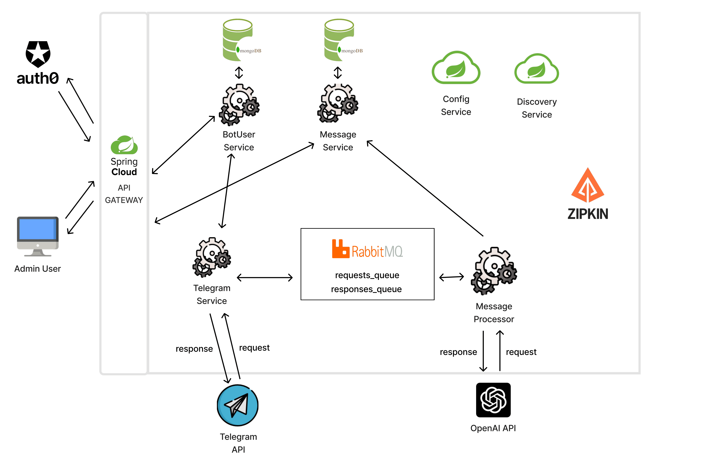

# СleverMate project

Revolutionize your conversational experience with our cutting-edge system, seamlessly merging the power of Telegram with the extraordinary capabilities of OpenAI's ChatGPT 3.5. This integration offers unparalleled convenience, providing users with effortless access to the AI model through a user-friendly and dynamic Telegram bot. Elevate your interactions, transcend boundaries, and unlock the potential of natural language processing like never before. Welcome to the future of intelligent communication. 

## Technology stack
Java 17, Spring Boot 3 (Cloud, Security, Web, Validation), OpenFeign, Resilience4j, Auth0, MongoDB, RabbitMQ, Telegram API 5.7.1, OpenAI API, Zipkin

## How to deploy with docker

Firstly you need to fulfill environment properties in variables.env file.
Then go to the project root folder and execute such command:

```
docker-compose -f docker-compose.yml --env-file ./variables.env  up -d
```

## Architecture



